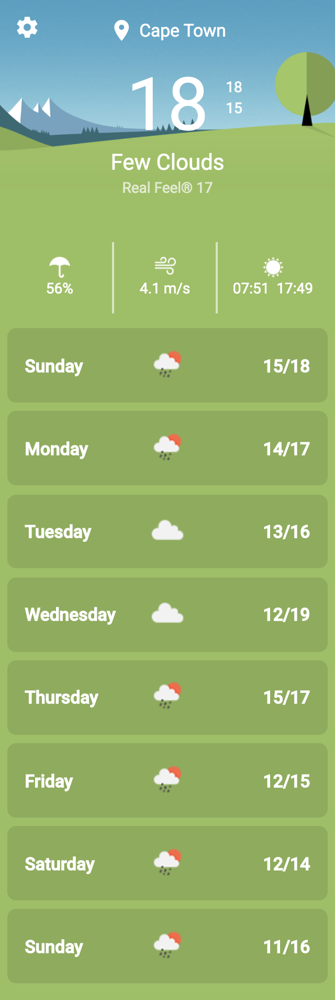

# MamaMoney Weather App

1. Stores Data in LocalStorage
1. Testing passing
1. 2 Views: Home and Settings
1. Using OpenWeather Icons on images
1. `npm run lint` passing
1. Using Angular Material Library
1. Polling the API was interesting, never did it before
1. Use of iff and concatMap is new to me, enjoyed playing around with it
1. Provide design it was based off

--------

## Screenshot

_Based of the [Xperial Weather App](src/assets/images/xperia-weather-app.jpg)_

